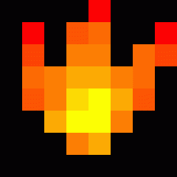

# gif2sprites
Converts animated gif to a single image with it's sprites. Designed to work with the 33x11 led name badge ls32

This project's solely purpose is to produce compatible sprite images for the **[Led Name Badge L32](https://github.com/jnweiger/led-name-badge-ls32)** project, for **33x11** ls32 screens.

## Example

### Original gif



### Converted


## Installation

1. Install dependencies (virtualenv is reccomended)  
    ```sh
    pip install -r requirements.txt
    ```
1. Run script with python interpreter

## Usage

1. **Convert gif to image**  
    ```text
    usage: main.py [-h] [--bin-threshold BIN_THRESHOLD] [--invert] [--white-bg]
                 FILE

    Convert gif image to a single image with its frames

    positional arguments:
    FILE                  Gif file path

    optional arguments:
    -h, --help            show this help message and exit
    --bin-threshold BIN_THRESHOLD, -b BIN_THRESHOLD
                          Binarization threshold (black and white conversion)
    --invert, -i          Invert colors
    --white-bg, -w        White background. By default, black is used.
    ```
1. **Pass image to led name badge script** (using the project's instructions)  
    ```sh
    python3 ./led-badge-11x44.py -s9 -m5 :flame.png:
    ```

### Binarization

As the screen doesn't support grayscales, each frame has to be binarized, converting every pixel either to absolute white or absolute black.
This process takes into account a threshold gray level from where flip from black to white.

The example was produced with a threshold of 30, as the flames are rather dark, and the background is absolute 0.

## TODO

* Fix: Simulate frames duration (currently they're just equally spaced in time)
* Minimal GUI
* Preview generated frames
* Support for other screen sizes (currently only 33x11 supported)
